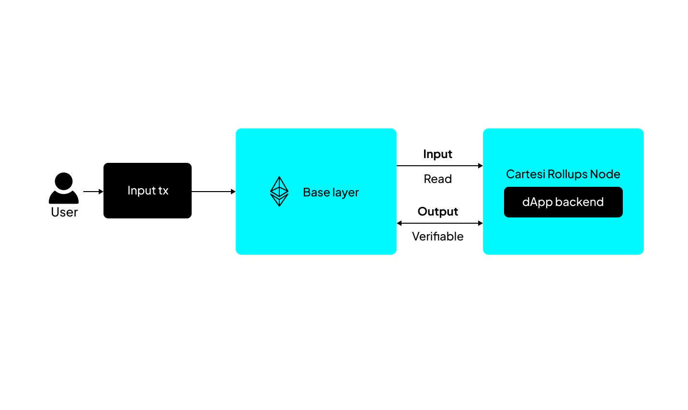
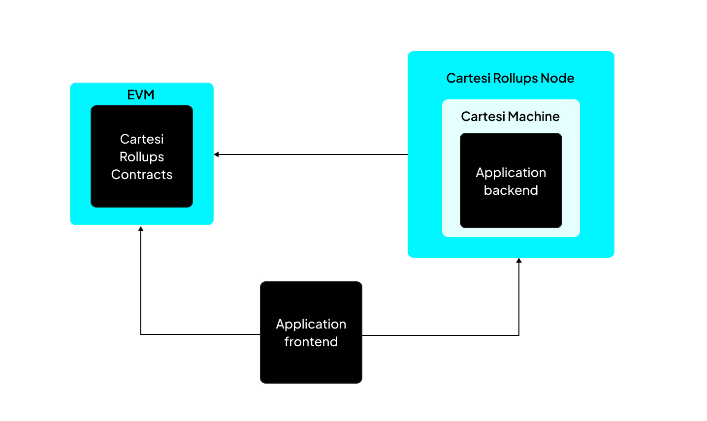
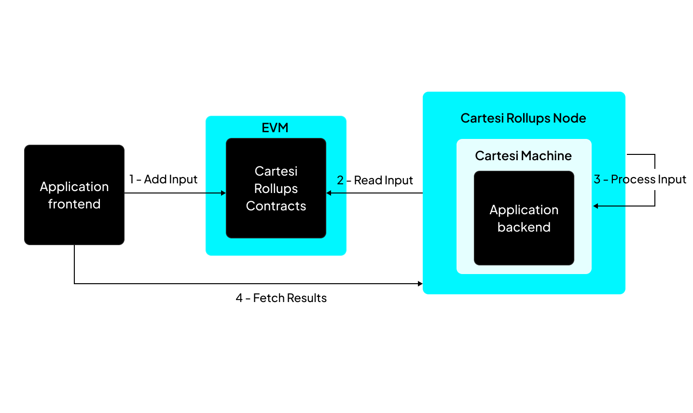
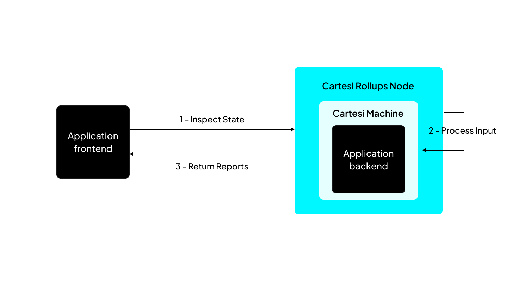
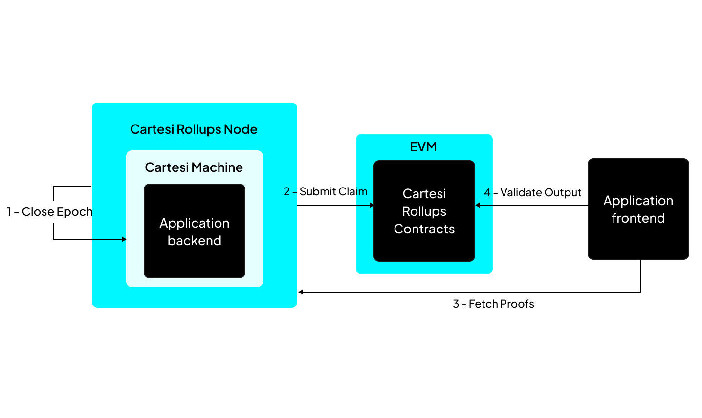

# DApp Calculator

by Jason YY Lin

This simple demo aims to give an instruction to build an DApp by creating straight-forward calculator function.

## Arch

### Concept



This framework has 2 main components:
1.  on-chain base layer (such as Ethereum): where the dApp contract is deployed
2.  off-chain execution layer: where the dApp's backend logic operates



- Cartesi Rollups: A set of on-chain (rollups contracts) and off-chain (rollups node) components
- Cartesi Machine: A Linux VM based on RISC-V, serving dApp's backend
- Backend: As standard Linux app
- Frontend: Web App or CLI

## Data Flow

### Advance state



### Inspect state



## Validation



## Algo: dave

This is an dispute resolution algo base on Permissionless Refereed Tournaments:
`https://arxiv.org/abs/2212.12439`

In a nutshell, this approach, where the resources required to defend against disputes grow logarithmically with the number of opponents:
`https://github.com/cartesi/dave`

## Setup

```bash
# env
# WSL2 with docker desktop on Windows

# Docker RISC-V support
docker run --privileged --rm tonistiigi/binfmt --install all

# nvm
# https://github.com/nvm-sh/nvm?tab=readme-ov-file#installing-and-updating
curl -o- https://raw.githubusercontent.com/nvm-sh/nvm/v0.40.1/install.sh | bash
# in lieu of restarting the shell
\. "$HOME/.nvm/nvm.sh"
command -v nvm

# Node.js (v22.14.0 LTS)
# https://nodejs.org/en/download
nvm install 22
node -v
nvm current
npm -v

# Cartesi CLI
npm i -g @cartesi/cli

# NoNodo
# https://github.com/Calindra/nonodo?_gl=1*1fxtcs4*_ga*NDMyMDU4MjU3LjE3NDEzNjI0OTk.*_ga_T83Y2T80M9*MTc0MTQyNDE1Ni40LjEuMTc0MTQyNzA2MC4wLjAuMA..
export ANVIL_TAG=nightly-2cdbfaca634b284084d0f86357623aef7a0d2ce3
npm i -g nonodo
nonodo
```

## App

```bash
# app backend skaffold
cartesi create calculator --template python

# write code

# build docker based app (compiles into RISC-V arch)
cartesi build

# run app (docker compose up)
cartesi run
Attaching to prompt-1, validator-1
validator-1  | 2025-03-08 13-11-59 info remote-cartesi-machine pid:144 ppid:85 Initializing server on localhost:0
prompt-1     | Anvil running at http://localhost:8545
prompt-1     | GraphQL running at http://localhost:8080/graphql
prompt-1     | Inspect running at http://localhost:8080/inspect/
prompt-1     | Explorer running at http://localhost:8080/explorer/
prompt-1     | Bundler running at http://localhost:8080/bundler/rpc
prompt-1     | Paymaster running at http://localhost:8080/paymaster/
prompt-1     | Press Ctrl+C to stop the node

# test: send inputs
cartesi send generic
> cartesi send generic
? Chain Foundry
? RPC URL http://127.0.0.1:8545
? Wallet Mnemonic
? Mnemonic test test test test test test test test test test test junk
? Account 0xf39Fd6e51aad88F6F4ce6aB8827279cffFb92266 9999.970671818064986684 ETH
? Application address 0xab7528bb862fb57e8a2bcd567a2e929a0be56a5e
? Input String encoding
? Input (as string) 1+7
✔ Input sent: 0xe2a2ba347659e53c53f3089ff3268255842c03bafbbf185375f94c7a78f3f98a

# test: receive outputs
# send generic will send a notice containing a payload to the Rollup Server's /notice endpoint
# Notice payloads will be returned in hexadecimal format; devs will need to decode these to convert them into plain text.
# use:
'http://localhost:8080/graphql'

# query: all notices sent to the rollup server
query notices {
  notices {
    edges {
      node {
        index
        input {
          index
        }
        payload
      }
    }
  }
}
# payload
{
  "data": {
    "notices": {
      "edges": [
        {
          "node": {
            "index": 0,
            "input": {
              "index": 0
            },
            "payload": "0x38"
          }
        }
      ]
    }
  }
}

# also, in container logs:
validator-1  | [INFO  rollup_http_server::http_service] Received new request of type ADVANCE
validator-1  | [INFO  actix_web::middleware::logger] 127.0.0.1 "POST /finish HTTP/1.1" 200 206 "-" "python-requests/2.31.0" 0.001664
validator-1  | INFO:__main__:Received finish status 200
validator-1  | INFO:__main__:Received advance request data {'metadata': {'msg_sender': '0xf39fd6e51aad88f6f4ce6ab8827279cfffb92266', 'epoch_index': 0, 'input_index': 0, 'block_number': 93, 'timestamp': 1741439706}, 'payload': '0x312b37'}
validator-1  | INFO:__main__:Received input: 1+7
validator-1  | INFO:__main__:Adding notice with payload: '8'
validator-1  | [INFO  actix_web::middleware::logger] 127.0.0.1 "POST /notice HTTP/1.1" 201 11 "-" "python-requests/2.31.0" 0.000896
validator-1  | INFO:__main__:Received notice status 201 body b'{"index":0}'
validator-1  | INFO:__main__:Sending finish
```
